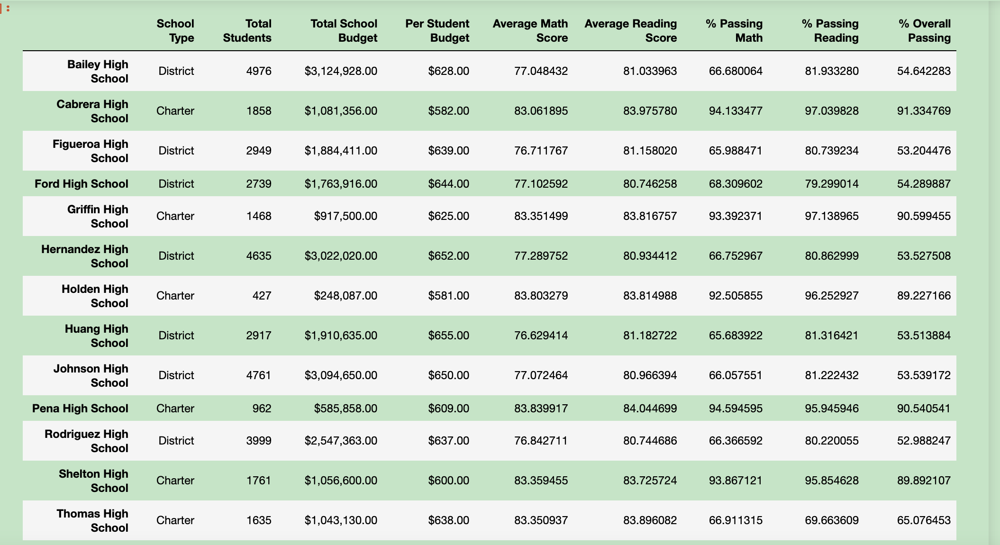

# School_District_Analysis
## Overview of the school district analysis
The school board  find academic dishonesty at 9th in Thomas High Schoold and find asked Maria to replace the math and reading scores at 9th for Thomas High School with NaNs while keeping the rest of the data intact. I report to describe how these changes affected the overall analysis. It will help School Boards to decide to next year budget
## Results 

###Replacing the ninth graders' math and reading scores with NaN resulted in the following changes for Thomas High School(THS):

### How is the district summary affected?

The overall passing percentage for the district fell to 64.9%
### How is the school summary affected?
The overall passing percentage for Thomas High School decrase from 90% to 65%

Thomas High School is not longer to Top 5 School.

### How does replacing the ninth graders’ math and reading scores affect Thomas High School’s performance relative to the other schools?
Relative ranking for THOMAS HS changed from 2ND to 8TH,
### How does replacing the ninth-grade scores affect the following:
#### Math and reading scores by grade
all the 9th grade in Thomas High School become NAN, so 9th of THS is last one, other grade is not change

#### Scores by school spending
no change
#### Scores by school size
BEFORE change: # of Student Thomas High School       1635
AFTER cleanup: # of Student Thomas High School       1174
#### Scores by school type
Thomas High School is Charter. Charter school is still better than district 

##Summary
After the make 9th grade of Thomas High School become the nan, THS's rank is from 2rd to 8th (out of Top 5). The pass rate of passing math and reading is from 90% to 65%.  The school size of THS is from 1635 to 1174. However the overall of charter is still better than district.
